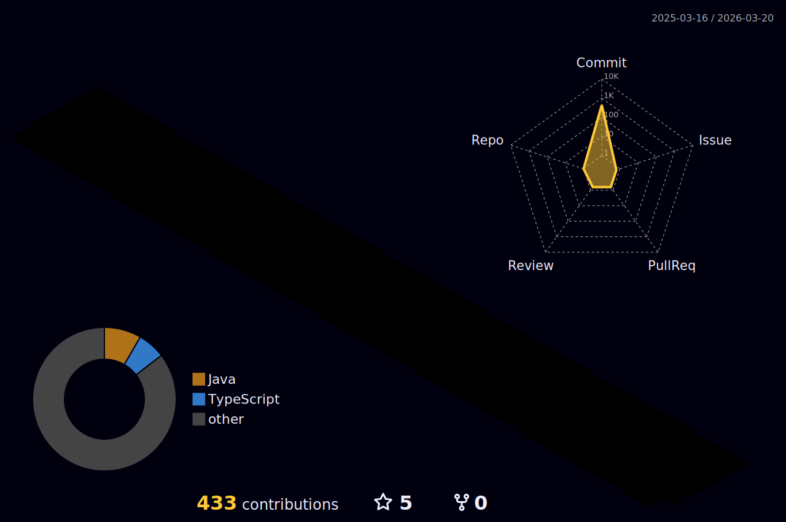

# Hello!🖐 I'm Jae-min KIM  

 

a 22-year-old college student  
	
who dreams of becoming a AI engineer.  
	
Currently, I'm focusing on studying Deep Learning,  
	
and I'm always willing to learn. 

## Tech Stack

 
 

 	

 

